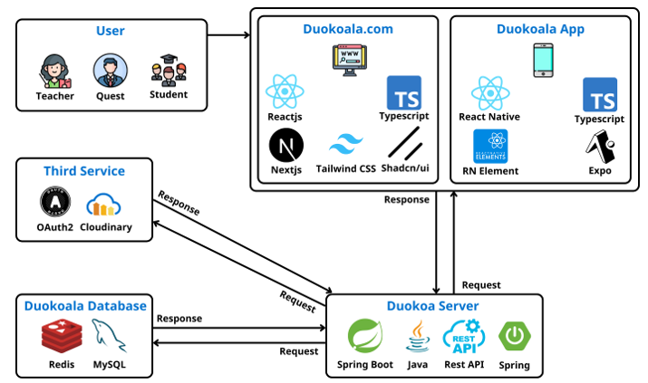

# Ứng Dụng Chia Sẻ Khóa Học Trực Tuyến

## Giới Thiệu

Ứng dụng Chia Sẻ Khóa Học Trực Tuyến là một nền tảng toàn diện kết nối giáo viên và học viên trong môi trường học tập trực tuyến. Dự án được phát triển với mục tiêu cung cấp trải nghiệm học tập linh hoạt, thuận tiện cho cả giáo viên và học viên.



## Thành Viên

1. Nguyễn Văn Lẹ - lelacquoi@gmail.com
2. Lê Dương Anh Tú - leduonganhtu0102@gmail.com
3. Nguyễn Lê Tiến Đạt - tiendat29082003@gmail.com

## Tính Năng Chính

### Cho Giáo Viên

- Tạo và quản lý khóa học dễ dàng
- Theo dõi tiến độ học tập của học viên
- Truy cập báo cáo thống kê chi tiết về các khóa học
- Quản lý nội dung bài giảng và bài kiểm tra

### Cho Học Viên

- Truy cập khóa học mọi lúc, mọi nơi
- Theo dõi tiến trình học tập cá nhân
- Tham gia các bài kiểm tra trực tuyến
- Giao diện thân thiện trên nhiều thiết bị

## Công Nghệ Sử Dụng

### Frontend

- Web: NextJS, TypeScript
- Mobile: React Native

### Backend

- Java Spring Boot
- MySQL

### Các Công Nghệ Bổ Sung

- Xác thực: JWT, OAuth2
- API: RESTful
- Quản lý hình ảnh: Cloudinary

## Yêu Cầu Hệ Thống

### Môi Trường Phát Triển

- Node.js (v14+)
- Java JDK (v11+)
- MySQL Server

### Công Cụ Cần Thiết

- npm/yarn
- Maven
- Git

## Cài Đặt Và Chạy Dự Án

### Bước 1: Clone Dự Án

```bash
git clone https://github.com/Nguyenvanle/multi-koala.git
cd multi-koala
```

### Bước 2: Cài Đặt Backend

```bash
cd server
mvn clean install
mvn spring-boot:run
```

### Bước 3: Cài Đặt Frontend Web

```bash
cd ../web
npm install
npm run dev
```

### Bước 4: Cài Đặt Ứng Dụng Mobile

```bash
cd ../mobile
npm install
npx react-native run-android
# hoặc
npx react-native run-ios
```

## Cấu Trúc Thư Mục

```
multi-koala/
│
├── server/     # Mã nguồn Spring Boot
├── web/        # Mã nguồn NextJS
├── mobile/     # Mã nguồn React Native
├── docs/       # Tài liệu dự án
└── README.md
```

## Đóng Góp Dự Án

1. Fork dự án
2. Tạo branch tính năng (`git checkout -b feature/AmazingFeature`)
3. Commit thay đổi (`git commit -m 'Add some AmazingFeature'`)
4. Push lên branch (`git push origin feature/AmazingFeature`)
5. Mở Pull Request

## Giấy Phép

Dự án được phân phối dưới Giấy Phép MIT. Xem `LICENSE` để biết thêm chi tiết.

## Liên Hệ

[Koala Team] - [lelacquoi@gmail.com]
